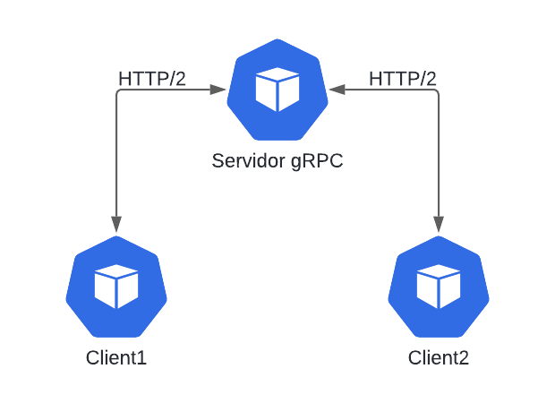

# Prueba de concepto Actividad - Tendencias en Arquitectura de Software

# Tema: HTTP/2 y gRPC

## Descripción
Esta prueba tiene como objetivo validar el funcionamiento del marco de trabajo gRPC, simulando la comunicación de 2 clientes y un servidor, en la cual los clientes consumen una funcion del servidor utilizando gRPC, la funcion regresa una respuesta con la comunicación exitosa al cliente especifico. Esta prueba se realizó utilizando docker para simular el ambiente.

## Objetivo
Verificar la Comunicación gRPC: Comprobar que un cliente y un servidor gRPC pueden comunicarse correctamente.

## Pasos implementados para realizar la prueba
- Elaboración del codigo Python tanto para los clients como para el servidor.
- Definir el servicio gRPC en un archivo '.proto'
- Generar los archivos de código python necesarios usando grpcio-tools.
- Configurar los clientes para realizar llamadas periódicas al servidor gRPC.

## Tecnologías Usadas en la prueba
### Lenguajes:
- Python
### Librerías:
- grpcio
- grpcio-tools
- protobuf

### Herramientas:
- Docker
- Docker Compose

## Resultados

### Configuración y Ejecución:

    Los contenedores de Docker (server, client1 y client2) se construyeron y levantaron correctamente.
    Los clientes gRPC realizaron llamadas exitosas al servidor gRPC, evidenciado por los logs generados en ambos contenedores.

### Verificación de la Comunicación:

    Los logs de los clientes mostraron respuestas exitosas del servidor, confirmando que la comunicación gRPC se estableció correctamente.
    Los logs del servidor indicaron que recibió y procesó las solicitudes del cliente, confirmando la correcta implementación del servicio gRPC.

## Conclusiones

Comunicación gRPC: La prueba confirmó que el cliente y el servidor gRPC pueden comunicarse correctamente en un entorno Docker Compose.

Uso de HTTP/2: Aunque no se realizó una captura de tráfico para confirmar explícitamente el uso de HTTP/2, se confía en que gRPC utiliza HTTP/2 como protocolo de transporte, ya que es el protocolo subyacente predeterminado para gRPC.

Verificación de Funcionamiento: Los logs generados por el cliente y el servidor proporcionaron evidencia clara de que la comunicación y el procesamiento de solicitudes gRPC se realizaron correctamente.